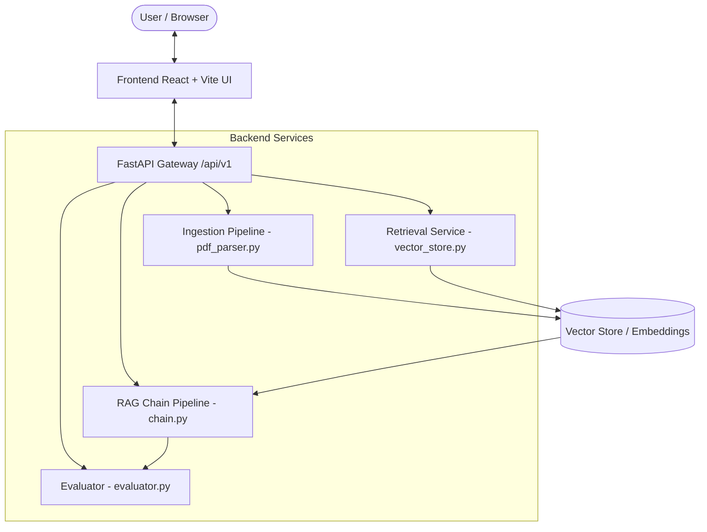

# System Architecture Document 📐

## Overview
ResearchPilot follows a modular, decouplable microservice-ready architecture separating document ingestion, hybrid vector retrieval, RAG generation pipelines, and automated evaluation metrics.

## Core Components
1. **`app/ingestion/`**: Parses PDF/raw text files into semantic chunks and generates embeddings.
2. **`app/retrieval/`**: Interacts with the vector database to retrieve top-K relevant paper contexts.
3. **`app/rag/`**: Synthesizes structured research answers using LLM generation chains.
4. **`app/evaluation/`**: Evaluates outputs across faithfulness and relevance metrics.
